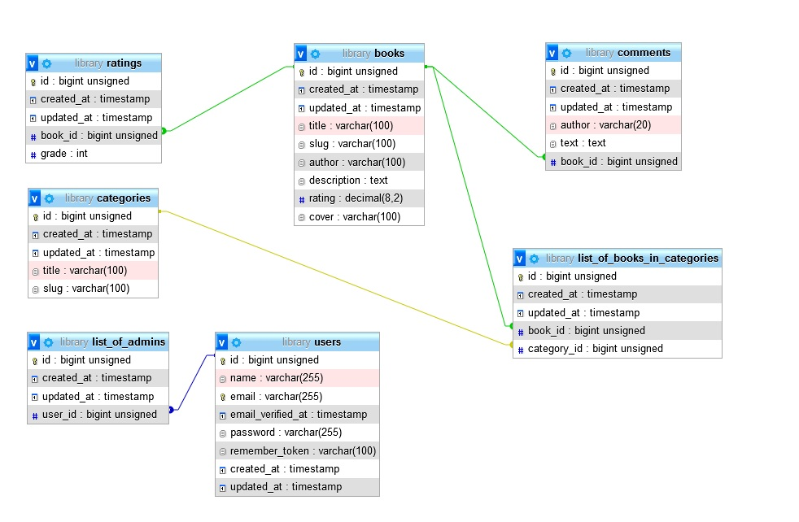

# Тестовое задание “Cистема управления библиотекой”

## Задача

● Необходимо создать небольшую систему управления библиотекой. 
Сотрудникам необходимо иметь реестр всех книг. Все книги распределены по категориям(секциям) библиотеки

● Каждая книга имеет следующую информацию: [title, slug, author, description, rating, cover(картинка)]

● Каждая категория: [title, slug] 

● <b>Дизайн и верстка не принципиальны.</b>
● Будет плюсом, если реализуете функционал с помощью <b>TALL</b>

## Функционал:

● Авторизация для сотрудников

● Регистрация для читателей

● Создайте CRUD для книг, категорий, сотрудников

● Страницы просмотра книги

● Страница с просмотром списка книг. Используйте пагинацию по 10 книг на странице

## Минимальные требования

● Используйте Laravel

● Все обложки должны сохраняться в папке storage/app/public/covers

● Используйте Request классы

● Используйте seeds для создания первого пользователя с помощью (admin@domain.com password) и заполнения таблиц тестовыми данными. 
Для картинок можете использовать сервис placeholder.com или любую готовую картинку.

● Используйте миграции

● Используйте отношения

## Продвинутые задачи
● Реализуйте email уведомление при добавлении нового сотрудника

● Добавьте возможность читателям оставлять комментарии к книгам

● Реализуйте API

● Реализуйте парсер excel файла с реестром книг через job по 100 книг за раз. Можете использовать maatwebsite/excel

(Пример таблицы: https://docs.google.com/spreadsheets/d/1LpyjeuO9Tz7zN4myiDSt1AVlGn9PFd4l/edit#gid=682307266 )

Схема бд в моем решении:

